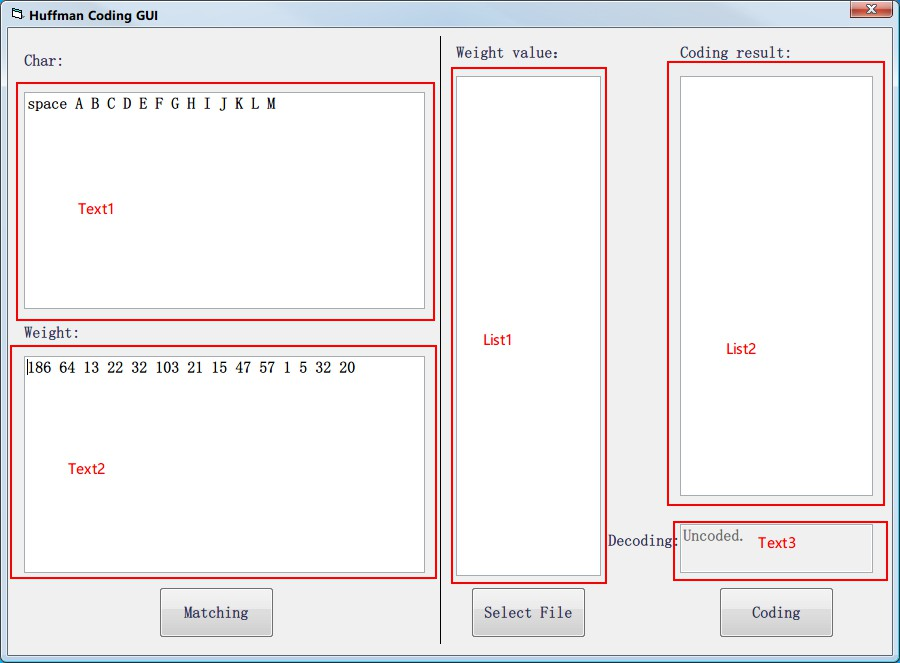
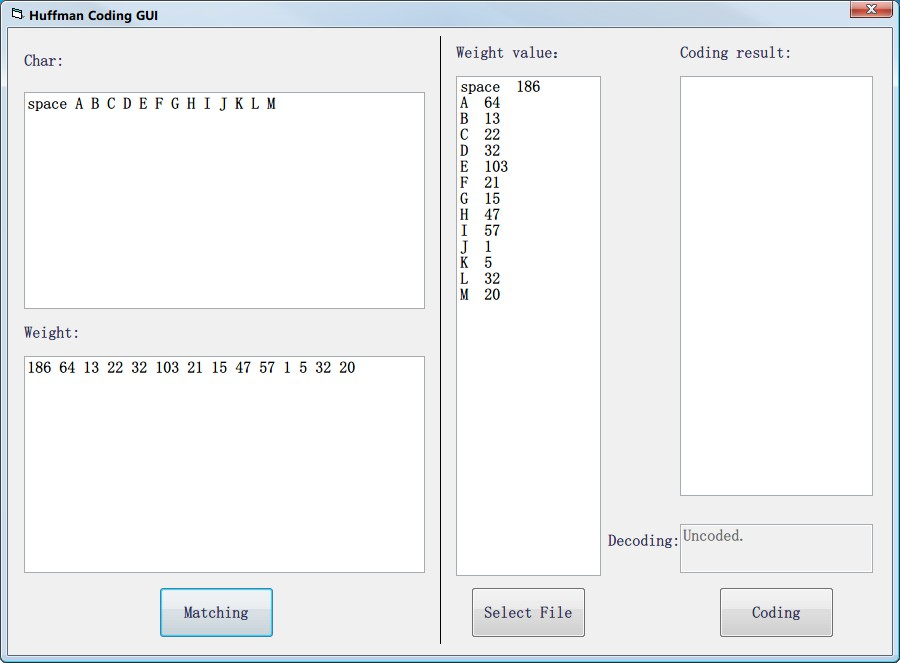
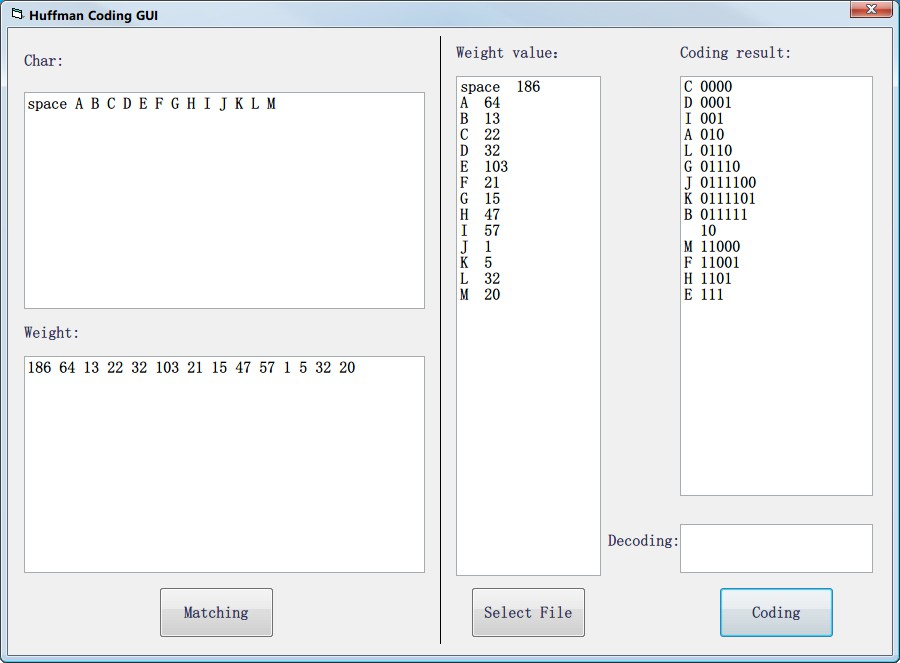
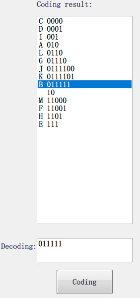

## 软件功能

1.  实现字符的哈夫曼编码
	​	1. 从文本文件中读取并自行统计字符数后进行编码
	​	2. 向软件界面中输入字符与对应的权值进行编码
2. 结果保存

   1. 字符与对应的权值保存在data.txt

   2. 字符与对应的编码保存在coding result.txt
3. 解码
4. 优化界面，实现图形化界面

## 使用说明

1. 运行Huffman Coding GUI.exe，程序界面说明如下：

2. 在Text1中输入字符在Text2中输入与字符对应的权值，如：

		space A B C D E F G H I J K L M
		186 64 13 22 32 103 21 15 47 57 1 5 32 20

3. 点击Matching按钮，List1中会出现字符和编码一一对应的每一项数据

4. 点击Coding按钮，List2中出现字符和编码结果，并Text3变为可输入状态

5. 在Text3中输入编码，即可进行解码

## 目录结构

- src
- - Huffman Coding GUI.vbp、Huffman Coding GUI.vbw...（VB工程文件和源代码）
  - main.cpp（C源代码）
  - SkinH窗体皮肤模块、aero.she..（皮肤文件）
- - coding.jpg
   - decoding.jpg
   - matching.jpg
   - 界面说明.jpg
- Huffman Coding GUI.exe（主程序）
- Huffman Coding.exe
- ReadMe.md
- SkinH.dll
- aero.she